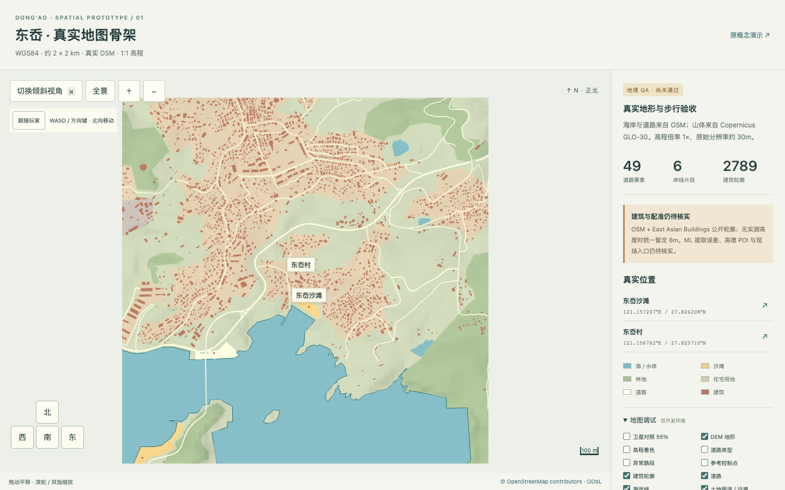
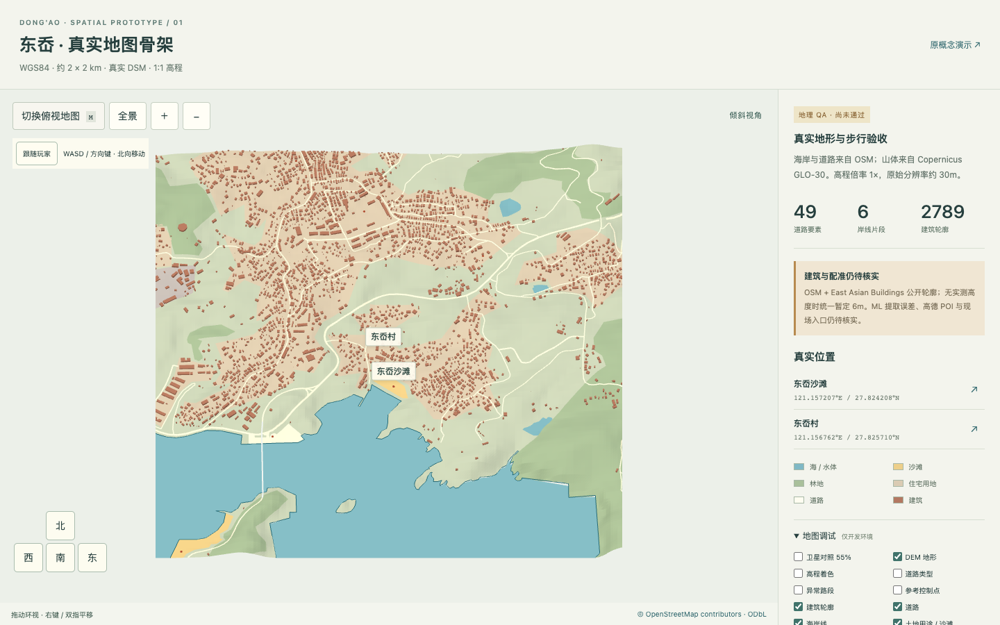
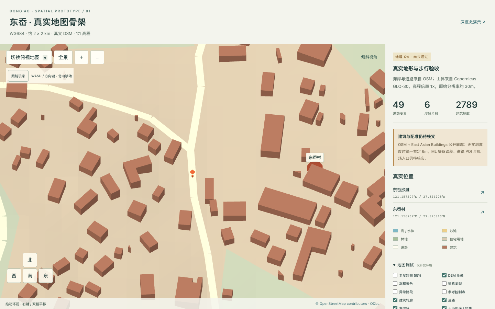
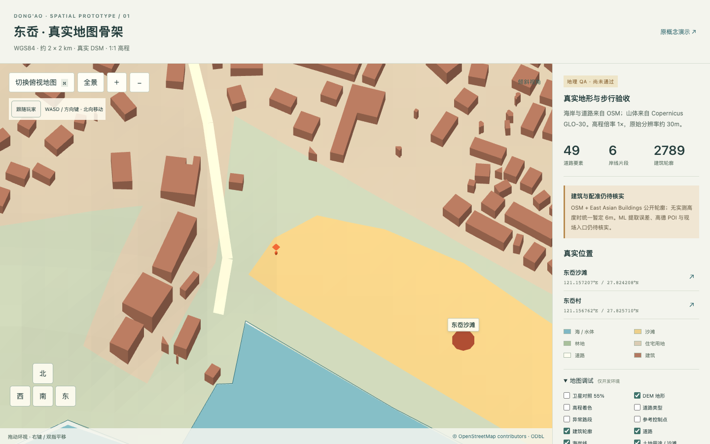
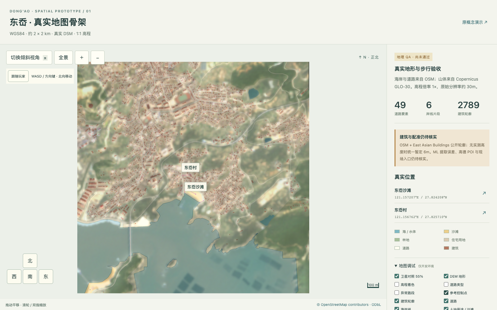
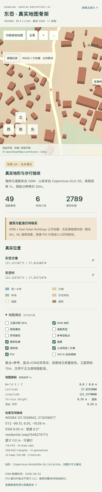
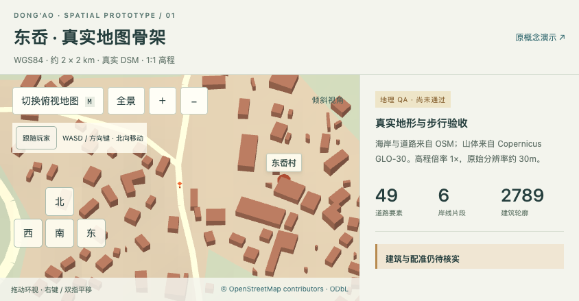

# 本轮交付

项目已可运行；完整地理验收未通过，当前不能进入玩法阶段。

- [运行与复现步骤](../README.md)
- [质量报告：验收结果、必须修 / 建议修 / 可以进入下一阶段](geography-validation.md)
- [数据来源、许可及 DEM / 建筑处理说明](data-sources.md)
- [完整数据性能报告](performance-report.md) / [原始采样](performance/full-data-benchmark.json)
- [与上一版的结构化差异（OSM 几何逐项相等比较）](geography-diff.json)
- [机器可读地理报告](../data/dongao/quality-report.json)
- [DEM 来源与处理参数](../data/dongao/dem/manifest.json) / [网格校验清单](../data/dongao/dem/mesh-manifest.json)
- [建筑逐栋源数据](../data/dongao/buildings-eab.geojson) / [建筑来源清单](../data/dongao/sources/buildings-manifest.json)
- [控制点：原始、参考、采用坐标与误差](../data/dongao/controls.json)

## 实际运行画面

### 桌面正北俯视

### 1:1 高程倾斜 3D

### 村旁道路出生点

### 沙滩到达点（非已核实入口）

### 独立卫星图半透明对照和控制点

### 移动端竖屏 / 横屏

图片均来自项目实际浏览器运行，不是生成的效果图。移动端是桌面 Chrome 的触控与视口模拟。
